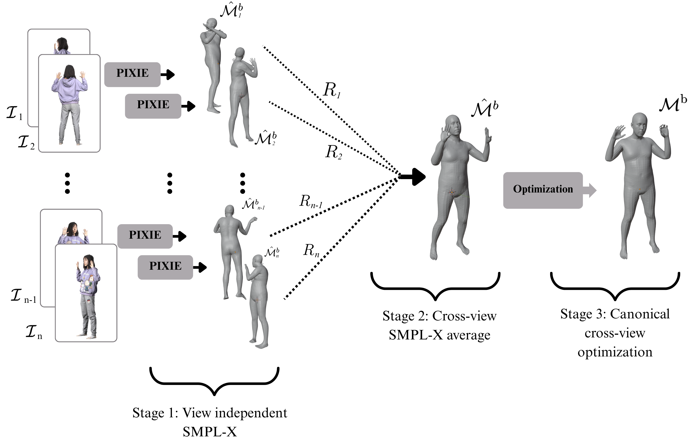

<!-- PROJECT LOGO -->

<p align="center">

  <h1 align="center">MExECON: Multi-view Extended Explicit Clothed Humans Optimized via Normal integration</h1>

  <div align="center">
    
  </div>

<br>

**MExECON** is an extension of the ECON pipeline for high-detail human avatar reconstruction. It leverages sparse multi-view RGB images instead of a single view, using a **Joint Multi-view Body Optimization (JMBO)** step to fit a single SMPL-X model consistently across all viewpoints. This optimized body acts as a low-frequency prior, while fine details (e.g., hair, clothing) are recovered through normal integration from predicted front and back view normal maps. The method delivers higher fidelity than single-view approaches and is competitive with few-shot multi-view 3D reconstruction methods.
<br/>

## Joint Multi-view Body Optimization (JMBO)
  <div align="center">
    
  </div>
Joint Multi-view Body Optimization (JMBO) estimates a single SMPL-X body model from multiple RGB views and their camera parameters, ensuring consistency across viewpoints and avoiding artifacts from occluded areas. It starts by predicting per-view SMPL-X fits with PIXIE, averaging shape and pose parameters to initialize the body. This model is then jointly optimized across all views using a multi-view loss that combines silhouette, normal, landmark, and head alignment terms, weighted to balance their contributions.

## Instructions

- See [installion doc for Windows](docs/installation-windows.md) to install all the required packages and setup the models on _Windows_
- See [installion doc for Ubuntu](docs/installation-ubuntu.md) to install all the required packages and setup the models on _Ubuntu_


## Demos

- ### Quick Start

```bash
# For single-person image-based reconstruction (w/ l visualization steps, 2 min)
python -m apps.infer -cfg ./configs/econ.yaml -in_dir ./examples -out_dir ./results


```
